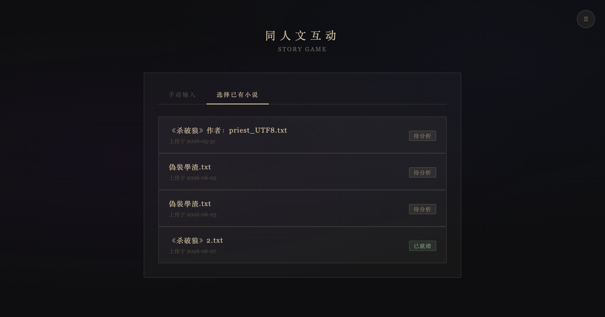
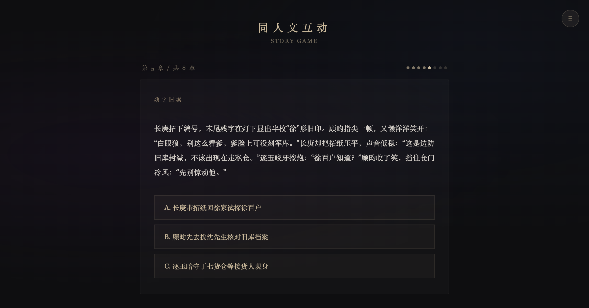
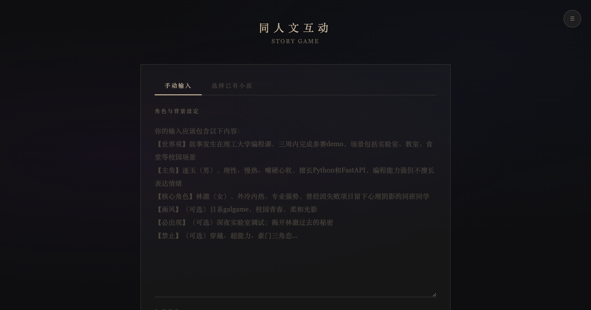
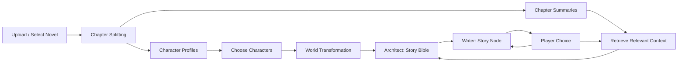

# Source-Fiction Interactive Generator

English | [中文](README.zh-CN.md)

Upload a source novel, choose original characters, transform the world setting, and generate an interactive fan-fiction story with branching choices.

This project is not a generic chatbot for writing fiction. It is a small RAG-based story game pipeline designed for one specific workflow: turning a source novel into a playable, choice-driven fan-fiction experience while preserving character voice, relationships, and story context.

## Demo

### Select a Source Novel



### Play Through Branching Chapters



### Create from Manual Character Setup



## What It Does

| Capability | How it works |
| --- | --- |
| Source novel ingestion | Uploads novels, normalizes text encoding, splits chapters, and builds a local index. |
| Character consistency | Extracts character profiles, speech style, behavior patterns, backstory, and relationships. |
| Long-context handling | Avoids stuffing the full novel into prompts; retrieves chapter summaries and relevant scenes for each story node. |
| Story planning | Uses an Architect prompt to create a Story Bible before generating chapters. |
| Branching narrative | Uses a Writer prompt to generate scene text, chapter state, and three player choices. |
| Consistency review | Uses Reviewer constraints to check voice, relationship logic, backstory, and OOC risk. |
| Debugging output | Saves generated Story Bibles and story runs locally for review. |

## Workflow



## RAG Design

The project treats a long novel as structured context instead of raw prompt text.

1. **Chapter layer**: the source novel is split into chapters and indexed.
2. **Character layer**: character profiles capture personality, speech, handling style, backstory, relationships, and key events.
3. **Summary layer**: chapter summaries provide lightweight global context.
4. **Scene layer**: relevant original scenes are retrieved based on the current story node and player choice.
5. **Generation layer**: retrieved context is injected into the prompt only when it is useful for the current chapter.

This keeps prompts smaller and more targeted while preserving original-novel constraints.

## Prompt Design

The generation pipeline is split into specialized roles:

| Role | Responsibility |
| --- | --- |
| Architect | Builds the Story Bible: genre, logline, protagonists, main conflict, forbidden items, open threads, and ending direction. |
| Writer | Generates the current chapter scene, narrative text, story-state patch, and player choices. |
| Reviewer | Adds consistency checks for character voice, relationship logic, backstory continuity, and tone alignment. |

This separation keeps planning, writing, and consistency control from competing in one oversized prompt.

## Architecture

This repository contains two cooperating local apps:

- `rag-agent/`: novel ingestion, encoding cleanup, chapter splitting, character extraction, summaries, indexing, and retrieval.
- `Story-game/`: interactive story UI, upload proxy, character selection, world transformation, Story Bible generation, and branching story generation.

Users open `Story-game` in the browser. `rag-agent` remains the internal analysis and retrieval service.

## Local Setup

### 1. Start rag-agent

```bash
cd rag-agent
cp .env.example .env
npm install
npm start
```

Default URL:

```text
http://localhost:3000
```

Configure `rag-agent/.env`:

```bash
API_KEY=your_real_api_key
BASE_URL=https://your-openai-compatible-api.example.com/v1
MODEL=your_model_name
MAX_TOKENS=2048
TEMPERATURE=0.7
TOP_K_CHUNKS=3
CHUNK_SIZE=500
CHUNK_OVERLAP=50
PORT=3000
TIMEOUT=60000
INDEX_FILE=./index.json
```

### 2. Start Story-game

```bash
cd Story-game
cp .env.example .env
npm install
npm start
```

Default URL:

```text
http://localhost:3002
```

Configure `Story-game/.env`:

```bash
API_KEY=your_real_api_key
BASE_URL=https://your-openai-compatible-api.example.com/v1
MODEL=your_model_name
MAX_TOKENS=2048
TEMPERATURE=0.8
PORT=3002
RAG_AGENT_URL=http://localhost:3000
```

Then open:

```text
http://localhost:3002
```

## Generated Files

- `Story-game/story_bible/`: generated Story Bible files.
- `Story-game/story_runs/`: generated chapter text, player choices, and story state for testing.
- `rag-agent/uploads/`: uploaded documents and cleaned text files.
- `rag-agent/chapters/`: extracted character profile files.
- `rag-agent/index.json`: generated local retrieval index.

## Notes

- Do not commit `.env`, uploaded novels, generated indexes, generated Story Bibles, or story runs.
- `Story-game/config.js` is still loaded by the browser for local testing. Do not place production API keys in browser code.
- For production use, route all LLM calls through a server-side proxy.
