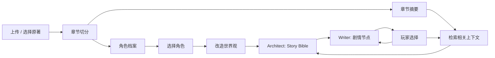

# 原著同人互动生成器

[English](README.md) | 中文

上传原著，选择角色，改造世界观，生成一段可以由玩家选择推进的互动同人故事。

这个项目不是通用小说写作聊天机器人，而是一条面向同人文互动生成的 RAG 工作流：把长篇原著解析成角色、关系、章节摘要和相关场景，再将这些上下文注入分支剧情生成过程，尽量保持人物语气、关系逻辑和剧情连贯性。

## 产品展示

### 选择原著小说


### 生成分支剧情


### 手动输入设定


## 核心能力

| 能力 | 实现方式 |
| --- | --- |
| 原著接入 | 上传小说后进行编码清洗、章节切分和本地索引构建。 |
| 角色一致性 | 抽取角色性格、说话风格、行为方式、背景故事、人物关系和关键事件。 |
| 长文本处理 | 不把整本小说直接塞进 Prompt，而是按当前剧情节点检索章节摘要和相关场景。 |
| 故事规划 | 通过 Architect Prompt 先生成 Story Bible，确定主线冲突、角色定位、禁忌项和结局方向。 |
| 分支正文生成 | 通过 Writer Prompt 生成当前章节正文、故事状态更新和三个玩家选项。 |
| 一致性约束 | 通过 Reviewer 约束人物语气、关系逻辑、背景连续性和 OOC 风险。 |
| 测试复盘 | 本地保存 Story Bible 和每次 Story Run，方便查看生成过程和正文效果。 |

## 工作流程



## RAG 设计

项目没有把长篇原著当成一段超长 Prompt，而是拆成多层结构化上下文：

1. **章节层**：对小说进行章节切分，并建立本地索引。
2. **角色层**：抽取角色画像，包括性格、语气、行为方式、背景故事、人物关系和关键事件。
3. **摘要层**：生成章节摘要，用轻量信息保留全局剧情脉络。
4. **场景层**：根据当前剧情节点和玩家选择检索相关原著场景。
5. **生成层**：只把当前生成最需要的角色约束、关系约束和场景参考注入 Prompt。

这样可以降低上下文冗余，同时让生成内容更贴近原著。

## Prompt 设计

生成链路拆成三个职责明确的角色：

| 角色 | 职责 |
| --- | --- |
| Architect | 生成 Story Bible：题材、梗概、主角、核心冲突、禁忌项、开放伏笔和结局方向。 |
| Writer | 生成当前章节：场景标题、正文、故事状态更新和玩家选项。 |
| Reviewer | 检查人物语气、关系逻辑、背景连续性、剧情节奏和 OOC 风险。 |

这种分层方式把“规划故事”“写正文”“控制一致性”拆开，避免所有目标挤在一个 Prompt 里互相干扰。

## 项目结构

本仓库包含两个协作运行的本地应用：

- `rag-agent/`：负责小说上传、编码处理、章节切分、角色档案提取、章节摘要、索引和检索。
- `Story-game/`：负责互动故事页面、上传代理、角色选择、世界观改造、Story Bible 生成和分支剧情生成。

用户主要打开 `Story-game` 页面；`rag-agent` 作为后台小说分析和检索服务运行。

## 本地启动

### 1. 启动 rag-agent

```bash
cd rag-agent
cp .env.example .env
npm install
npm start
```

默认地址：

```text
http://localhost:3000
```

配置 `rag-agent/.env`：

```bash
API_KEY=your_real_api_key
BASE_URL=https://your-openai-compatible-api.example.com/v1
MODEL=your_model_name
MAX_TOKENS=2048
TEMPERATURE=0.7
TOP_K_CHUNKS=3
CHUNK_SIZE=500
CHUNK_OVERLAP=50
PORT=3000
TIMEOUT=60000
INDEX_FILE=./index.json
```

### 2. 启动 Story-game

```bash
cd Story-game
cp .env.example .env
npm install
npm start
```

默认地址：

```text
http://localhost:3002
```

配置 `Story-game/.env`：

```bash
API_KEY=your_real_api_key
BASE_URL=https://your-openai-compatible-api.example.com/v1
MODEL=your_model_name
MAX_TOKENS=2048
TEMPERATURE=0.8
PORT=3002
RAG_AGENT_URL=http://localhost:3000
```

然后打开：

```text
http://localhost:3002
```

## 生成文件

- `Story-game/story_bible/`：每次开局生成的 Story Bible 设定档。
- `Story-game/story_runs/`：测试时保存的章节正文、玩家选项和故事状态。
- `rag-agent/uploads/`：上传的原始小说文件和清洗后的文本。
- `rag-agent/chapters/`：提取出的角色档案文件。
- `rag-agent/index.json`：本地生成的检索索引。

## 注意事项

- 不要提交 `.env`、上传小说、生成索引、Story Bible 或 Story Run。
- 当前 `Story-game/config.js` 仍会被浏览器加载，仅适合本地测试；不要把生产 API Key 放进浏览器代码。
- 如果部署到生产环境，建议把所有 LLM 调用都代理到服务端。
